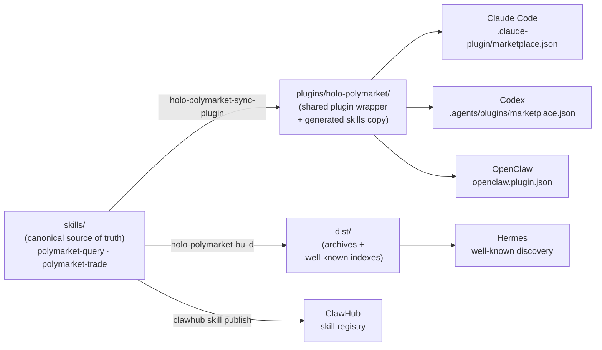

<div align="center">

# Holo Polymarket

### Agent Skills for Polymarket prediction markets — research and trade, from one canonical source.

Read-only market research and safe CLOB trading, packaged as local plugins for
**Claude Code**, **Codex**, and **OpenClaw**, and published as skills via
**ClawHub** and **Hermes**-compatible discovery.

[](https://github.com/helebest/holo-polymarket/actions/workflows/ci.yml)
[](https://github.com/helebest/holo-polymarket/actions/workflows/release.yml)
[](https://github.com/helebest/holo-polymarket/releases/latest)
[](LICENSE)
[](pyproject.toml)

[](#install)
[](#install)
[](#install)
[](skills/polymarket-query/SKILL.md)
[](https://polymarket.com)

</div>

---

**Holo Polymarket** ships two complementary skills from one canonical `skills/`
directory: ask your agent to research a market — hot events, search, history,
whales, positions — or to place and manage real orders through Polymarket's
official CLOB API. Trading is **dry-run by default**, so previewing costs is
always safe; spending real money takes an explicit, order-bound confirmation.

## What can it do

- 🔎 **Research, read-only** — hot markets, keyword search, event detail and
  token ids, historical price/probability and volume trends, whale leaderboard,
  any address's positions, P&L, and trade history. Export to **CSV/JSON**.
- 💸 **Trade, safely** — buy/sell (market or limit), check collateral balance,
  list open orders, and cancel — over the official CLOB API. **Dry-run by
  default**; executing needs `--execute` plus a matching `--confirm <token>`.
- 🧩 **Multi-runtime** — one source of truth, packaged as local plugins for
  Claude Code, Codex, and OpenClaw, and published via ClawHub and Hermes
  well-known discovery.
- 🔐 **Secret-safe** — agent-neutral, gitignored credentials; secrets are never
  printed.

## The two skills

| | [`polymarket-query`](skills/polymarket-query/SKILL.md) | [`polymarket-trade`](skills/polymarket-trade/SKILL.md) |
| --- | --- | --- |
| **Purpose** | Read-only research and whale/position tracking | Place and manage real orders |
| **Language** | Bash (`curl` + `jq`) | Python (`py-clob-client-v2`) |
| **Highlights** | hot · search · detail · history · trend · volume-trend · leaderboard · positions · trades · CSV/JSON export | buy · sell (market/limit) · balance · orders · cancel |
| **Spends money?** | Never | Only with `--execute --confirm <token>` |
| **Credentials** | None (a bearer token is optional, only for historical prices) | Required for live trading |

## How distribution works

One canonical `skills/` directory is the single source of truth. From it, the
same two skills are packaged as local plugins for **Claude Code**, **Codex**, and
**OpenClaw**, and published as skills through **ClawHub** and **Hermes**-compatible
well-known discovery — no per-runtime forks, no copy drift. Edit once; the
distribution tooling fans it out.

- **Write once.** Author skills in `skills/` using the standard AgentSkills
  folder format.
- **Sync automatically.** `holo-polymarket-sync-plugin` regenerates the plugin
  copy; `holo-polymarket-validate` enforces cross-runtime invariants in CI.
- **Ship everywhere.** `holo-polymarket-build` produces skill/plugin archives
  and well-known discovery indexes for every runtime.
- **Safe by default.** Every order is a dry-run until you opt in with an explicit
  confirmation token.



The copy under `plugins/holo-polymarket/skills/` is generated from `skills/` by
`holo-polymarket-sync-plugin` and committed alongside the wrapper. **Do not edit
it by hand.**

## Quick start

No credentials, no risk — the research skill is read-only and only needs `bash`,
`curl`, and `jq`:

```bash
git clone https://github.com/helebest/holo-polymarket
cd holo-polymarket

# Top 5 hottest markets right now
bash skills/polymarket-query/scripts/polymarket.sh hot 5

# Search, then inspect an event by slug
bash skills/polymarket-query/scripts/polymarket.sh search bitcoin 5
bash skills/polymarket-query/scripts/polymarket.sh detail fed-decision-in-march-885
```

Ready to trade? See [Trading](#trading-polymarket-trade) — and read the
[proxy-wallet note](#credentials) first.

## Requirements

| Component | Needs |
| --- | --- |
| `polymarket-query` | `bash`, `curl`, `jq` |
| `polymarket-trade` | Python 3.10+; `pip install -r skills/polymarket-trade/scripts/requirements.txt` (`py-clob-client-v2`, `requests`). Read-only commands and offline dry-run previews need no third-party packages. |
| Development tooling | Python 3.10+ and [`uv`](https://docs.astral.sh/uv/) |

## Install

### Claude Code

```text
/plugin marketplace add helebest/holo-polymarket
/plugin install holo-polymarket@holo-polymarket
```

Claude Code reads `.claude-plugin/marketplace.json` and loads
`plugins/holo-polymarket/.claude-plugin/plugin.json`, registering both skills.
For local development: `/plugin marketplace add /absolute/path/to/holo-polymarket`.

### Codex

Codex discovers the same plugin via `.agents/plugins/marketplace.json`. Running
Codex inside this directory lists `holo-polymarket` under available plugins; no
extra configuration is needed.

### ClawHub (OpenClaw skill registry)

```bash
npm i -g clawhub
clawhub skill publish skills/polymarket-query
clawhub skill publish skills/polymarket-trade
# install: clawhub install <publisher>/polymarket-query
```

### OpenClaw / Hermes / other agents

The skills use the AgentSkills folder format, so any compatible agent can consume
`skills/` directly:

- **OpenClaw**: copy/symlink folders under `skills/` into an OpenClaw skills
  directory, load `plugins/holo-polymarket/openclaw.plugin.json`, or
  `openclaw skills install`.
- **Hermes**: register this repo's `skills/` directory in `~/.hermes/config.yaml`,
  or host the generated `.well-known/agent-skills/index.json`.

See [registry/openclaw.md](registry/openclaw.md) and
[registry/hermes.md](registry/hermes.md).

## Usage

### Research (polymarket-query)

```bash
bash skills/polymarket-query/scripts/polymarket.sh hot 5
bash skills/polymarket-query/scripts/polymarket.sh search bitcoin 5
bash skills/polymarket-query/scripts/polymarket.sh detail fed-decision-in-march-885
bash skills/polymarket-query/scripts/polymarket.sh lb 10 pnl week
bash skills/polymarket-query/scripts/polymarket.sh pos 0xADDRESS 10 --active
bash skills/polymarket-query/scripts/polymarket.sh history fed-decision-in-march-885 2025-01-01 2025-01-31 1d --format csv
```

Prerequisites: `bash`, `curl`, `jq`. Time args: `from/to` = `YYYY-MM-DD`,
`interval` = `1h`/`4h`/`1d`. Full reference:
[skills/polymarket-query/references/commands.md](skills/polymarket-query/references/commands.md).

### Trading (polymarket-trade)

```bash
pip install -r skills/polymarket-trade/scripts/requirements.txt

# Inspect, then preview (dry-run prints a confirmation token)
python3 skills/polymarket-trade/scripts/trade.py market <market-slug>
python3 skills/polymarket-trade/scripts/trade.py buy <market-slug> yes --limit 0.40 --shares 10

# Execute with the token from the dry-run
python3 skills/polymarket-trade/scripts/trade.py buy <market-slug> yes --limit 0.40 --shares 10 \
  --execute --confirm <token>
```

> ⚠️ **Every order is dry-run by default.** Executing requires both `--execute`
> and a matching `--confirm <token>`. The token is bound to the full order, so
> changing any parameter re-previews and a stale confirmation can't execute a
> different order. Market **BUY** `--amount` is USDC to spend; market **SELL**
> `--amount` is shares to sell. See
> [skills/polymarket-trade/SKILL.md](skills/polymarket-trade/SKILL.md) and
> [skills/polymarket-trade/references/trading.md](skills/polymarket-trade/references/trading.md).

> Polymarket migrated to **CLOB V2** (pUSD collateral) on 2026-04-28; the legacy
> `py-clob-client` is non-functional. This skill targets `py-clob-client-v2`.
> The live trading surface is still stabilising upstream — preview with dry-runs,
> start small, and verify against your account.

## Credentials

Credentials live in a gitignored `KEY=VALUE` file (or `POLYMARKET_*` env vars),
resolved agent-neutrally: `POLYMARKET_*` env vars, then
`$POLYMARKET_CREDENTIALS_FILE`, then `./.credentials`,
`~/.config/holo-polymarket/credentials`, and finally
`~/.openclaw/credentials/polymarket_credentials`. Secrets are never printed;
`trade.py whoami` reports only which fields are present, plus the public address /
funder / signature type (never secret values). Copy
[`.credentials.example`](.credentials.example) to `./.credentials` to start.

> ⚠️ **Use your proxy wallet, not the signer.** Polymarket email/Magic (and
> browser) logins keep your USDC and positions in a deterministic **proxy
> wallet** whose address differs from the signer/EOA. The Data API and CLOB only
> ever see that proxy, so pointing a skill at the signer address shows an empty
> account. Set `POLYMARKET_FUNDER` to the proxy and `POLYMARKET_SIGNATURE_TYPE=1`
> (email/Magic). Copy the proxy address from the logged-in Polymarket profile URL
> (`polymarket.com/@0x…`) or the top-right account menu.

Which keys each core workflow uses (recommended name; short aliases like
`API_KEY` / `SECRET` / `FUNDER` are also accepted, matching Polymarket's export):

| Key (aliases) | Purpose | Positions / balance | Trading |
| --- | --- | --- | --- |
| `POLYMARKET_FUNDER` (`FUNDER`) | Proxy wallet holding funds/positions | **Required** | **Required** |
| `POLYMARKET_SIGNATURE_TYPE` (`SIGNATURE_TYPE`) | `0` EOA · `1` email/Magic · `2` browser · `3` deposit | — | **Required** (email/Magic = `1`) |
| `POLYMARKET_PRIVATE_KEY` (`PRIVATE_KEY`, `PK`) | Signs orders (EIP-712) | — | **Required** |
| `POLYMARKET_API_KEY` / `_API_SECRET` / `_API_PASSPHRASE` (`API_KEY`, `SECRET`, `PASSPHRASE`) | CLOB L2 auth | Needed for `balance`/`orders` | **Required** |
| `POLYMARKET_ADDRESS` (`PRIVATE_ADDRESS`) | Signer EOA | `FUNDER` fallback / info only | `FUNDER` fallback only |
| `POLYMARKET_BEARER_TOKEN` (`BEARER_TOKEN`) | Query historical-price auth (optional) | Not used | Not used |
| `RECOVERYCODE` | Magic recovery phrase | **Ignored** | **Ignored** |

With `POLYMARKET_FUNDER` set, the query skill's `positions` / `trades` and
`trade.py positions` default to your own wallet when no address is given. Full
details: [skills/polymarket-trade/references/credentials.md](skills/polymarket-trade/references/credentials.md).

## Repository layout

| Path | Purpose |
| --- | --- |
| `skills/` | Canonical Agent Skills (source of truth): `SKILL.md` + `scripts/` + `references/`. |
| `plugins/holo-polymarket/` | Shared plugin wrapper for Claude Code, Codex, and OpenClaw, with a generated `skills/` copy. |
| `.claude-plugin/marketplace.json` | Claude Code marketplace (local plugin `source` is a string path). |
| `.agents/plugins/marketplace.json` | Codex marketplace (`source` object + `policy`). |
| `registry/` | ClawHub/OpenClaw and Hermes publication notes plus the well-known discovery template. |
| `src/holo_polymarket/` | Validation, plugin sync, and release-artifact build tooling. |
| `tests/` | Bash skill tests (offline + live) and Python repository/trade tests. |
| `dist/` | Generated release artifacts (gitignored). |

The copy under `plugins/holo-polymarket/skills/` is generated from `skills/` by
`holo-polymarket-sync-plugin` and committed alongside the wrapper. Do not edit it
by hand.

## Development

```bash
uv sync
uv run ruff check .
uv run ruff format --check .
uv run holo-polymarket-validate          # repository invariants
uv run holo-polymarket-sync-plugin --check
uv run python -m pytest                  # Python tests
bash tests/run_tests.sh                  # Bash skill tests (offline)
RUN_LIVE_TESTS=1 bash tests/run_tests.sh # + live API integration tests
```

CI (`.github/workflows/ci.yml`) runs lint, format check, `holo-polymarket-validate`,
and the plugin-sync check on Python 3.12, then runs the Python and Bash test
suites across Python **3.10 / 3.11 / 3.12 / 3.13** on Ubuntu and **3.12** on
macOS (the macOS job exercises the Bash skills on BSD userland), and builds the
release artifacts.

Regenerate the committed plugin skills copy after editing canonical skills:

```bash
uv run holo-polymarket-sync-plugin
```

Build release artifacts (skill/plugin archives + well-known discovery indexes +
checksums) under `dist/`:

```bash
uv run holo-polymarket-build
```

## Releasing

Versions are tracked in lockstep across every manifest and enforced by
`holo-polymarket-validate` (CI fails otherwise):

- `pyproject.toml`
- `.claude-plugin/marketplace.json` (metadata + plugin entry)
- the **Claude** plugin (`plugins/holo-polymarket/.claude-plugin/plugin.json`)
- the **Codex** plugin (`plugins/holo-polymarket/.codex-plugin/plugin.json`)
- the OpenClaw manifest (`plugins/holo-polymarket/openclaw.plugin.json`)
- `skills/polymarket-trade/SKILL.md`

To cut a release for an iteration:

1. Bump the version in all of the above (keep them identical) and add a
   `## X.Y.Z` section to `CHANGELOG.md`. `uv run holo-polymarket-validate`
   confirms the lockstep.
2. Merge to `main`.
3. Tag and push: `git tag vX.Y.Z && git push origin vX.Y.Z`.

The `Release` workflow (`.github/workflows/release.yml`) triggers on `v*.*.*`
tags: it verifies the tag matches `pyproject.toml`, runs the build, and publishes
a GitHub Release named `vX.Y.Z` with the skill/plugin zips and `checksums.txt`
attached and notes pulled from `CHANGELOG.md`.

## Contributing

Issues and pull requests are welcome. Before opening a PR, run the full quality
gate above (`ruff`, `holo-polymarket-validate`, the sync check, and both test
suites) so CI passes on the first try, and remember to run
`holo-polymarket-sync-plugin` and commit the regenerated
`plugins/holo-polymarket/skills/` copy whenever you change a canonical skill. All
documentation, code comments, and CLI output are written in English.

## License

[MIT](LICENSE) © 2026 helebest
